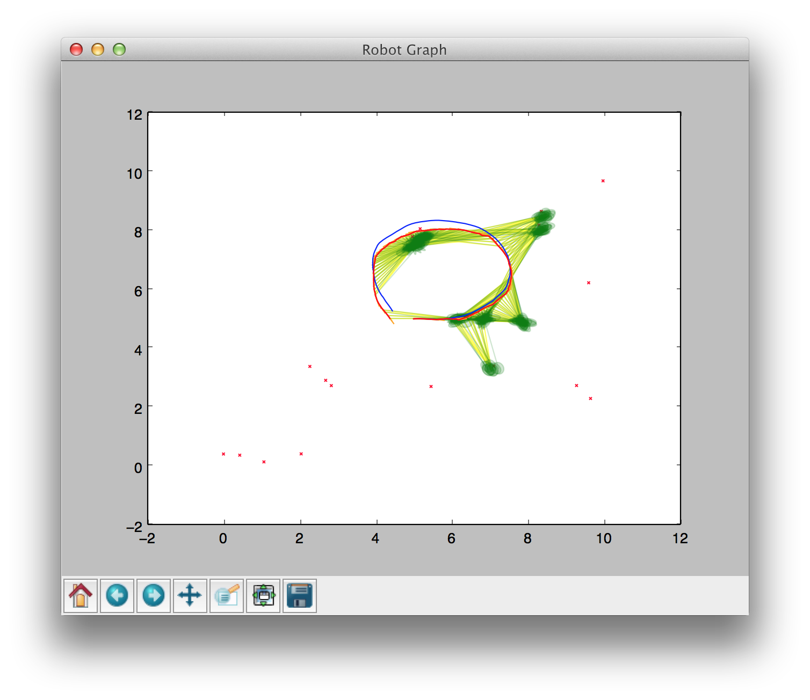
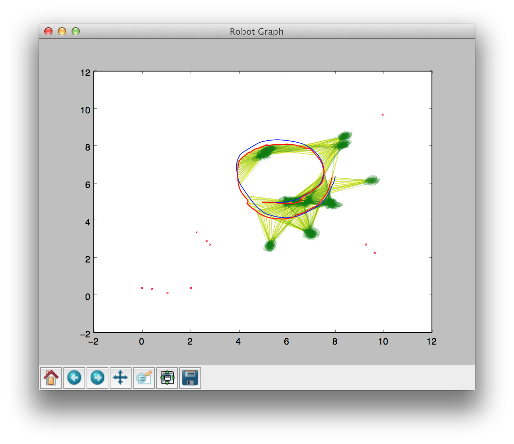
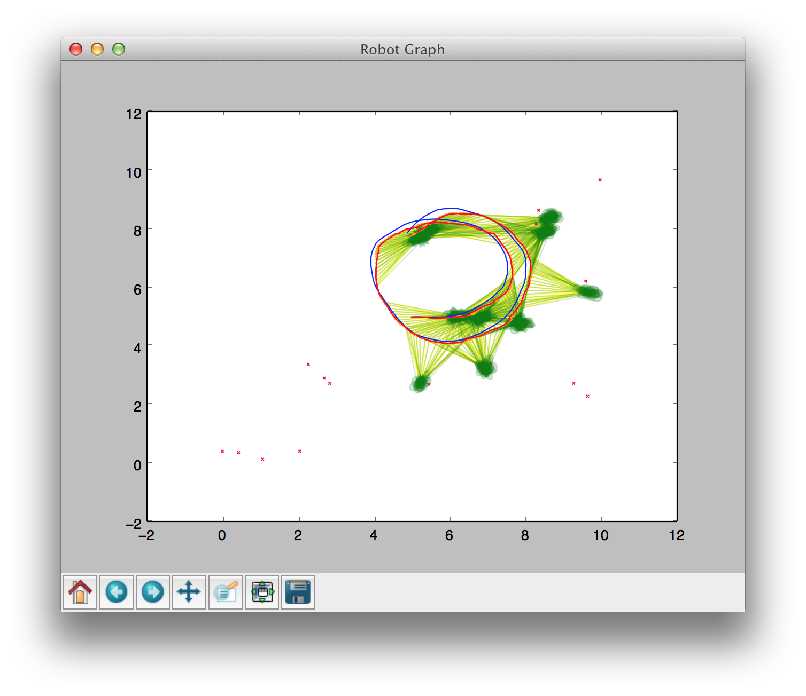
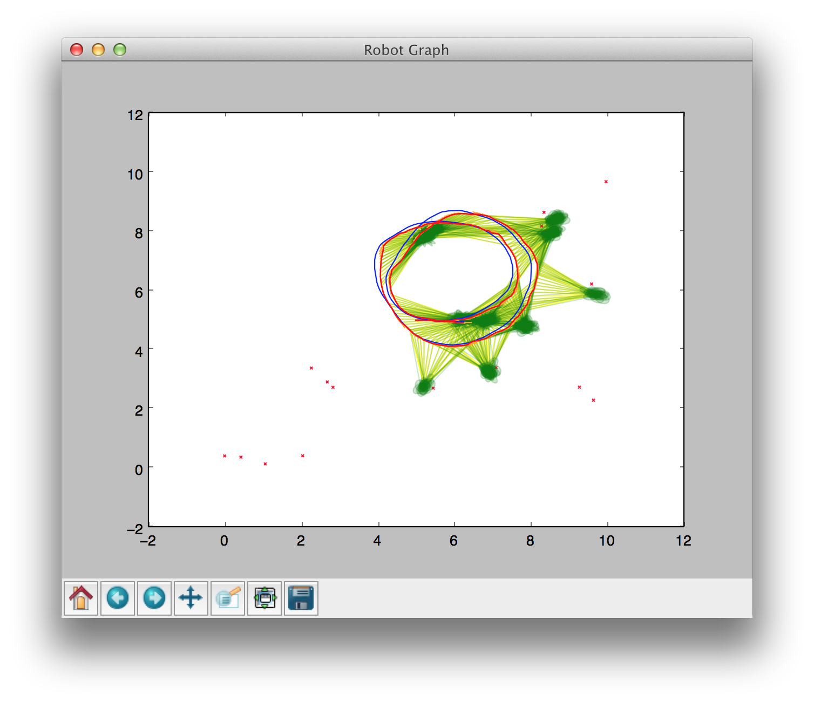

Smoothing and Mapping
---

This script uses pylab to simulate robots with sensors moving in an
environment simultaneously localizing and mapping.

You can define your own motion models and sensor models, and record
the robot(s) moving though a simulated 2D environment.

Currently, the code is a mess because I had a project deadline. Refer
to "NOTES" for more information.

I have written my own nonlinear graph optimizer in python for this
project. However, rather than use colamd and QR, I have just
implemented pinv which is inefficent and does not leverage the
sparsity of the problem.

Room for improvement:

*   create other sensor models (GPS)
*   create other motion models (gantry)
*   helper function for creating robots
*   generalize for multiple robots (merge graph)
*   colamd and QR for graph optimization
*   implement graph optimization in the robot class (as opposed to the simulator)

Writeup
=======

Smoothing and mapping (SAM) takes a probabilitic graphical model
approach to solving simultaneous localization and mapping (SLAM)
problems. The goal of this project is to implement SAM in a
generalizable way for easy implementation with arbitrary motion models,
sensor models, data association models, and any number or combination of
robots and sensors. A Python module was developed with a generalized
graph solver and a 2D robot simulator for recording trajectories and
running simulated SLAM experiments.

Background
==========

Simultaneous localization and mapping (SLAM) is a well known problem in
mobile robotics for estimating robot poition with respect to observed
landmarks based on uncertain motion and observation measurements. The
most common solution to this problem are extended Kalman filter (EKF)
methods. While filtering techniques are fast, they lack optimial
solutions. On the other hand, a smoothing recovers an optimal solution
but consumes much more computation.

SAM
---

The smoothing and mapping (SAM) algorithm is a smoothing
approach that leverages mathematics research in sparse linear algebra to
efficiently solve landmark-based SLAM problems. The paper very elegantly
discusses the relationships between solving Markov networks and and
solving a sparse least-squares problem from linear algebra.

The SAM algorithm works by building a graph of relationships between
robot configurations and landmarks where the edges represent the motion
and observations models. To optimize the graph, the edges error
functions are linearized creating a large, sparse least-squares
optimization problem. Due to the scale of typical SLAM problems, a
pseudo-inverse approach quickly becomes intractable. Thus, sparse linear
algebra tools are used for efficiently solving this least-squares
optimization. First, the columns are heuristically re-ordered using
`colamd` to reduce fill-in when factorizing the matrix. The paper
ellabotes on the interesting relationship between factorizing this
matrix (the information matrix) and factorizing a graph into a clique
tree. This matrix is efficiently factorized using a variety of methods:
Cholsky, QR, and LDL. The solution is then recovered trivially with back
substitution.

iSAM
----

The biggest drawback of vanilla SAM is that it requires entirely
refactorizing the information matrix when new data is observed. This
becomes a huge computational load for doing real-time state estimation
as the graph gets larger and larger. Incremental smoothing and mapping
(iSAM) solves this problem by utilizing some complicated
linear algebra for updating the QR factorized square-root information
matrix with new observations using Given’s rotations while reducing
fill-in by only updating the values that change. This is a huge step for
speeding up SAM for practical use in landmark-based SLAM. Occiasionally,
however, iSAM needs to reorder all the columns and entirely refactorize
the graph. This is necessary for efficiency especially when loops are
closed, but results in the algorithm slowing down periodically.

Other Research
--------------

There is a variety of other research in SAM, particularly with
decentralized SLAM with multi-robots. An interesting
related paper uses the same algorithm in SAM as a generalized graph
optimization tool.

Project Introduction
====================

The goal of this project is to create a generic framework for SAM to
fill the need for easy-to-use tools for implementing SAM in
landmark-based SLAM problems. There are a few existing SAM libraries in
C++, but they are old and have trouble compiling. Even if they do
compile, they are too terse to dive into. Thus, the SAM algorithm from
re-written from scratch. Inspired by g2o, the graph
optimizer was generalized for solving any observed log-linear Markov
network. A 2D robot simulator was also implemented for recording robot
trajectories and running SLAM simulations.

Implementation
==============

Everything was implemented in Python primarily using
*pylab*, a scientific computing library which is just a
wrapper for *numpy* and *matplotlib*. Python
is cross-platform, easy to use and easy to understand. Furthermore,
there are a variety of tools for installing and compiling libraries
which make it easy for the end-user. This software built with modularity
in mind not only allowing for arbitrary motion and sensor models, but
also to eventually port to ROS as rosnodes.

Robot Class
-----------

The Robot class is a generic class for a robot. This class must be
initialized with a motion model and an array of sensors. Upon creation,
this class initializes a graph with an initial position node and a prior
on that position.

The primary functions implemented by the robot class are
*move* and *sense* which are really just a
wrapper functions for the motion and sensor model classes that
constructs the nodes and edges of the graph.

The motion model class has a *move* function which defines
how the robot changes configuation based on motion commands. This class
is initialized with some predefined covariance of the motion
uncertainty. This class also computes the jacobian of the motion model,
which is analyitically solved using the *sympy* Python
module.

The sensor model class is very similar to the motion model class. It is
initialized with some predefined covariance of the measurement
uncertainty. It has a *sense* function in which any
data-association scheme can be implemented. It also has dead-reckoning
function for generating initial values of the landmark nodes. The sensor
model also computes the jacobians of the sensor model, also solved
analytically using the *sympy* module.

Graph Optimizer
---------------

The graph class builds a graph data-structute and optimizes the graph
based on the SAM algorithm. This class linearizes the graph to matrix of
adjacency jacobians and converts back to the graph data-structure to
update the values of the nodes. This was a huge book-keeping headache.
Currently, this class optimizes the graph using a pseudo-inverse which
is far less efficient than the algorithm is discussed in the paper.
However, this was a quick and easy solution to get working and leaves
room for future work.

The graph optimizer, inspired by, is generalized for
solving any observed log-linear Markov network. The node class is very
simple, with two variables. A value variable takes on either the robot
position or a landmakr position, and a descriptor variable is used for
data-association of the landmarks or time in the case of position.
Simple edge classes are needed for wrapping the motion model and sensor
model classes. An edge class in this graph must have two nodes, a value,
an error function, and a linearization function for computing the
jacobian of the error function with respect to each of the node values.
The value, in this case, is either a sensor measurement or a motion
command.

The optimization needs to be tuned for nonlinear graph models. Because
the robot has nonlinear motion and sensor models, the linearized
optimization must be iteratived computed, updating the graph and
relinearizing after each step. Upon each iteration, the graph update is
dampened by a factor of 0.2 in order to prevent instability. To improve
convergence to the global optima, a good initial value needs to be
chosen. An initial value for the nodes of the graph is computed by
averaging all of the dead-reckoned observations. The graph is also
incrementally optimized to reducing the error propagation of
dead-reckoned initial values.

Simulator
---------

The simulator class deals with all human interaction via terminal and
keeps track of the robots in a simulated map. The simulator can record
trajectories, plot trajectories, plot the graph optimization, and run
landmark-based SLAM simulations.

The simulator also currently serves as the centralized entity for
multi-robot SAM. Future work on this project will incorporte
communication models for sharing graph information between robots.

Results
=======

In the plots that follow, the blue line represents the ground truth
robot trajectory. The red line represents the dead-reckoned robot
trajectory before and the optimized trajectory after. The yellow lines
are the edges of the Markov network projects onto the node values. On
the map, there are small x-markers representing landmarks. The different
colored landmarks represent different kinds of landmarks that can be
sensed by the associated kind of sensor. The landmark observations are
drawn in the same color as line from the robot position to the
dead-reckoned landmark position with an ellipse representing the
uncertainty covariance of the observation.

The first successful simulation result is shown below.

This simulation involves a single robot with a sensor that can always
observe every landmark generating a dense graph. As you can see, the
observations do not overlap and after the optimization, all of the
observations are within two standard deviations of uncertainty.

The next simulation is a single robot with limited sensor to create a
sparse SLAM graph, shown in below. As discussed before,
this posed challenges for the nonlinear optimization due to local optima
and was overcome with better initial node values by averaging
dead-reckoned landmark positions and dampening the optimization.

 

The final tweak to the graph optimization algorithm was to incrementally
optimize the graph to avoid local optima by periodically updating the
graph for better initial values for the next nonlinear optimization
step. This simulation is show below.

The next simulation involves a single robot
with multiple sensors. This simulation shows a green sensor with a
limited distance, reasonable errors, and a a field of view restricted to
the forward-facing 180 degrees. The pink sensor is
long-range with high accuracy but a narrow field of view of
15 degrees. These sensors detect different kinds of
landmarks. This framework was designed in such a generalized way that
implementing multiple sensors involves adding another sensor to the
robot sensors array.

   

Finally, the holy grial of simulation results - multiple heterogeneous
robots with multiple heterogeneous sensors.
Both robots are differential drive with varying motion uncertainties and
all of the sensors are laser range finders with varying uncertainty and
constraints. However, this is still a heterogeneous system because the
varying constraints and uncertainties are all handled separately. Future
work will involved creating new motion and sensor models.

In this simulation, one robot begins at the bottom left heading towards
the top right, and another robot does the opposite. Both robots share a
common green sensor. The robot from the right has the same narrow field
of view but highly accurate pink sensor from the last example. The robot
from the left has a 360 degrees long range but very
inaccurate blue sensor.

  

Strengths
---------

SAM is an elegant implementation of a generalized graph optimization.
Creating new edges with different values and uncertainty models easily
adopts SLAM to various motion and sensor models. Furthermore, extending
SAM to multiple robots is trivial. Merging the graph is as simple as
computing the same data-association when observing a landmark. In a
practical setting, the only challenge for multiple robots is considering
the communication scheme robots.

SAM solves the *full SLAM problem*, obtaining a globally
optimal solution which outperforms filtering methods. Things like loop
closures are inherent to the optimization and do not need to be handles
separately as with filtering methods.

Weaknesses
----------

The weakness of SAM is its computational load. Though it recovers an
optimial solution, it also requires more and more compution as the
experiment moves on the and the graph gets larger. Although iSAM has
curbed this issue, it still required far more computation than filtering
approaches. EKF SLAM takes roughly the same amount of computation on
each time step.

Another weakness of SAM are the issues associated with nonlinear
optimization - local optima, linearization, dampening, and convergence.
However, this cannot be attributed to SAM itself - all nonlinear
optimization problems face these issues, but they are frustrating to
deal with nonetheless.

Summary
=======

Smoothing and mapping is, by most measures, a better way of solving
robotics landmark-based SLAM problems. However, it has yet to be widely
adopted because it is not nearly as simple and fast as EKF approaches.
However, this project implements a generalized SAM framework in Python
aimed to trivialize the difficulty in implementing SAM. This framework
involves a simulator, a generalized graph optimizer, and generalizable
motion and sensor models with an analytical jacobian solver.

While this framework is still far from complete, it is a step in the
direction on making SAM availiable and easy to implement.

Future Work
===========

This framework is still far from being finished. The following outlines
future work on this project which leads to a ROS package that should
alleviate the pains of implementing SAM on real robots.

-   Decentralized scheme for multi-robot SLAM.
-   Create various other motion models (bicycle model, quadcopter model)
-   Create various other sensor models (3D point cloud, SURF, GPS)
-   Implement colamd with QR for more faster graph optimization
-   Implement iSAM with givens rotations for faster real-time graph
update
-   Port this project to ROS

References
==========

1. Alexander Cunningham, Manohar Paluri, and Frank Dellaert. Ddf-sam: Fully distributed slam using constrained factor graphs. 2010.
2. Frank Dellaert and Michael Kaess. Square root sam: Simultaneous localization and mapping via square root information smoothing. 2006.
3. Michael Kaess, Hordur Johannsson, Richard Roberts, Viorela Ila, John Leonard, and Frank Dellaert. isam2: Incremental smoothing and mapping using the bayes tree. 2012.
4. Michael Kaess, Ananth Ranganathan, and Frank Dellaert. isam: Incremental smoothing and mapping. 2008.
5. R. Ku ̈mmerle, G. Grisetti, H. Strasdat, and W. Konolige, K. andBurgard. g2o: A general framework for graph optimization. 2011.
